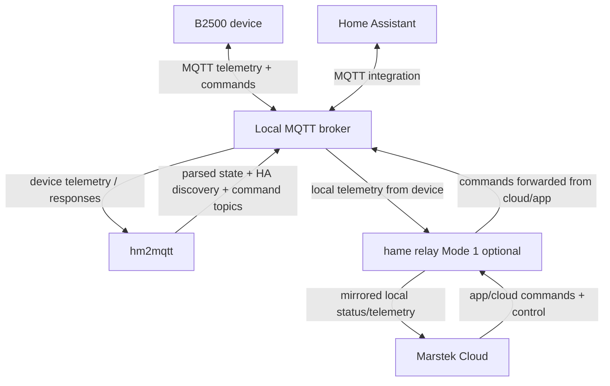
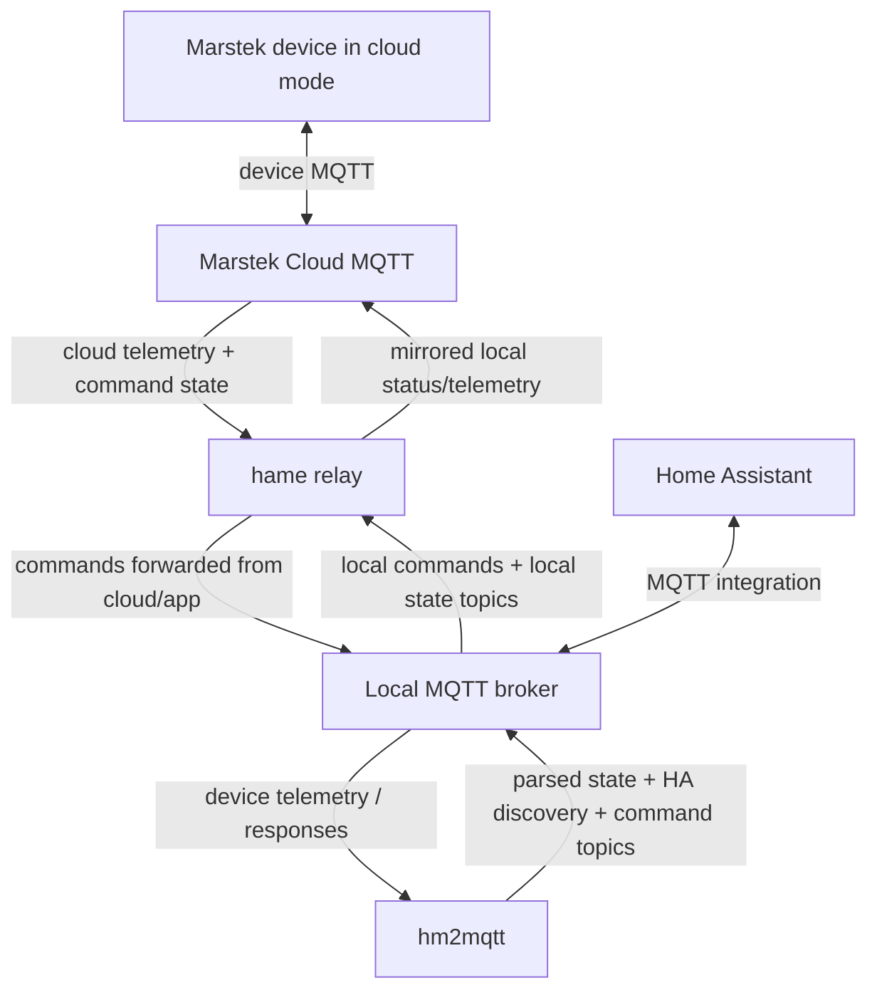

# hm2mqtt

Reads Hame energy storage MQTT data, parses it and exposes it as JSON.

## Overview

hm2mqtt is a bridge application that connects Hame energy storage devices (like the B2500 series) to Home Assistant (or other home automation systems) through MQTT. It provides real-time monitoring and control of your energy storage system directly from your Home Assistant dashboard.

## Supported Devices

- B2500 series (e.g. Marstek B2500-D, Greensolar, BluePalm, Plenti SOLAR B2500H, Be Cool BC2500B)
  - First generation without timer support
  - Second and third generation with timer support
- Marstek Venus C
- Marstek Venus E
- Marstek Jupiter C
- Marstek Jupiter E
- Marstek Jupiter Plus
- Marstek CT002 Smart Meter
- Marstek MI800 Micro Inverter

## Prerequisites

- A local MQTT broker (for example the Home Assistant Mosquitto broker): https://www.home-assistant.io/integrations/mqtt/#setting-up-a-broker
- Access to your device details (device type + Bluetooth MAC address) — how to find these is explained in the setup steps below.

## Step-by-step setup

Choose one of the following variants. Install hm2mqtt using your preferred method from the [Installation](#installation) section, then apply the matching setup flow below.

### Variant A: B2500 configured for local MQTT

Use this **only** for B2500 devices when your B2500 should send data directly to your local MQTT broker. If you have any other Marstek device type, follow **Variant B** instead.

**When to use:** Choose this if you want direct local MQTT communication from B2500 to your broker (for local-first integrations), and you accept that direct cloud connectivity is disabled unless you add hame-relay Mode 1.



> **⚠️ Cloud/app impact (read first):** Enabling local MQTT on the B2500 disables direct cloud connectivity for that device. You can restore app/cloud functionality by running hame-relay in Mode 1 (local broker setup). For more background, see [FAQ: When do I need hm2mqtt, hame-relay, or both?](#1-when-do-i-need-hm2mqtt-hame-relay-or-both).
>
> **⚠️ Important if you want to use multiple B2500 simultaneously:** For firmware `226.5` / `108.7`, you **must** use the hm2mqtt MQTT proxy port (default `1890`) to avoid client-ID conflicts. For newer firmware versions, the recommended approach is to configure different MQTT usernames per B2500. See [MQTT Proxy for B2500 Firmware 226.5/108.7 Client ID Conflict](#mqtt-proxy-for-b2500-firmware-22651087-client-id-conflict) for details.

1. **Enable and configure MQTT on the B2500**
   - Option 1: Contact support and ask them to enable MQTT in the app.
   - Option 2: Use the Bluetooth configuration tool in Chrome: https://tomquist.github.io/hmjs/
2. **Point the B2500 to your local broker**
   - Configure host/port (or proxy port `1890` if needed for multiple devices).
3. **Note the correct device ID**
   - Use the MAC shown in the Bluetooth tool (or app device list).
   - This is the value used by hm2mqtt (`deviceId` / `DEVICE_n`).
   - Do **not** use the Wi-Fi MAC.
4. **Configure hm2mqtt**
   - Add your MQTT broker settings.
   - **Home Assistant App:** add a device entry under `devices`:
     ```yaml
     devices:
       - deviceType: "HMA-1"
         deviceId: "001a2b3c4d5e"
     ```
   - **Docker / .env:** add `DEVICE_n` in format `{deviceType}:{bluetoothMac}` (for example `DEVICE_0=HMA-1:001a2b3c4d5e`).
5. **Start hm2mqtt**
   - After startup, Home Assistant should discover the new device via MQTT Discovery.

### Variant B: Other Marstek devices (and B2500 without local MQTT)

Use this for devices that stay on cloud MQTT (Venus/Jupiter/Jupiter Plus/MI800/CT002), or for B2500 when you do not switch it to local MQTT.

**When to use:** Choose this if your device remains cloud-configured, or if you want to keep the standard cloud setup and bridge data into your local broker via hame-relay.



1. **Install and configure hame-relay**
   - Follow the hame-relay README: https://github.com/tomquist/hame-relay
   - Enter your account credentials in hame-relay config.
   - Use a separate Marstek account (recommended):
     - Share your devices to that account.
     - Use that account in hame-relay.
     - This avoids logging your primary app account out of the mobile app session.
   - For B2500 in this variant, configure hame-relay inverse forwarding with the 24-character **cloud device ID** in `inverse_forwarding_device_ids` (from hame-relay startup/device output). In hm2mqtt, continue using the **Bluetooth MAC** as `deviceId` (see step 3 above). See hame-relay docs: https://github.com/tomquist/hame-relay#optional-settings

2. **Start hame-relay and check startup output**
   - hame-relay loads your account device list on startup.
   - From the startup logs/output, note:
     - `deviceType`
     - Bluetooth MAC address (used as hm2mqtt `deviceId`)
3. **Configure hm2mqtt**
   - Use `deviceType` + Bluetooth MAC from hame-relay output.
   - **Home Assistant App:** add entries under `devices`:
     ```yaml
     devices:
       - deviceType: "HMG-50"
         deviceId: "001a2b3c4d5e"
     ```
   - **Docker / .env:** add `DEVICE_n={deviceType}:{bluetoothMac}`.
4. **Start hm2mqtt**
   - Home Assistant should discover the devices once data is available on your local broker.

## Installation

### As a Home Assistant App (Recommended)

The easiest way to use hm2mqtt is as a Home Assistant App:

1. Add this repository URL to your Home Assistant App store:
   
   [](https://my.home-assistant.io/redirect/supervisor_add_addon_repository/?repository_url=https%3A%2F%2Fgithub.com%2Ftomquist%2Fhm2mqtt)
2. Install the "hm2mqtt" App
3. Configure your devices in the App configuration
4. Start the App

### Using Docker

#### Pre-built Docker Image

You can run hm2mqtt using the pre-built Docker image from the GitHub package registry:

```bash
docker run -d --name hm2mqtt \
  -e MQTT_BROKER_URL=mqtt://your-broker:1883 \
  -e MQTT_USERNAME=your-username \
  -e MQTT_PASSWORD=your-password \
  -e POLL_CELL_DATA=false \
  -e POLL_EXTRA_BATTERY_DATA=false \
  -e POLL_CALIBRATION_DATA=false \
  -e DEVICE_0=HMA-1:your-device-mac \
  --restart=unless-stopped \
  ghcr.io/tomquist/hm2mqtt:latest
```
**your-device-mac** has to be formatted like this: 001a2b3c4d5e  (no colon and all lowercase). It's the one mentioned before!

Configure multiple devices by adding more environment variables:

```bash
# Example with multiple B2500 devices (requires MQTT proxy):
docker run -d --name hm2mqtt \
  -e MQTT_BROKER_URL=mqtt://your-broker:1883 \
  -e MQTT_PROXY_ENABLED=true \
  -e MQTT_PROXY_PORT=1890 \
  -e DEVICE_0=HMA-1:001a2b3c4d5e \
  -e DEVICE_1=HMA-1:001a2b3c4d5f \
  -p 1890:1890 \
  --restart=unless-stopped \
  ghcr.io/tomquist/hm2mqtt:latest
```

The Docker image is automatically built and published to the GitHub package registry with each release.

### Using Docker Compose

A docker-compose example for multiple B2500 devices:

```yaml
version: '3.7'

services:
  hm2mqtt:
    container_name: hm2mqtt
    image: ghcr.io/tomquist/hm2mqtt:latest
    restart: unless-stopped
    ports:
      - "1890:1890"  # Expose proxy port for B2500 devices
    environment:
      - MQTT_BROKER_URL=mqtt://x.x.x.x:1883
      - MQTT_USERNAME=''
      - MQTT_PASSWORD=''
      - MQTT_PROXY_ENABLED=true  # Enable proxy for multiple B2500s
      - MQTT_PROXY_PORT=1890
      - POLL_CELL_DATA=true
      - POLL_EXTRA_BATTERY_DATA=true
      - POLL_CALIBRATION_DATA=true
      - DEVICE_0=HMA-1:0019aa0d4dcb  # First B2500 device
      - DEVICE_1=HMA-1:0019aa0d4dcc  # Second B2500 device
```

For a single B2500 device, you can omit the proxy configuration:

```yaml
version: '3.7'

services:
  hm2mqtt:
    container_name: hm2mqtt
    image: ghcr.io/tomquist/hm2mqtt:latest
    restart: unless-stopped
    environment:
      - MQTT_BROKER_URL=mqtt://x.x.x.x:1883
      - MQTT_USERNAME=''
      - MQTT_PASSWORD=''
      - POLL_CELL_DATA=true
      - POLL_EXTRA_BATTERY_DATA=true
      - POLL_CALIBRATION_DATA=true
      - DEVICE_0=HMA-1:0019aa0d4dcb  # 12-character MAC address
```

### Manual Installation

1. Clone the repository:
   ```bash
   git clone https://github.com/tomquist/hm2mqtt.git
   cd hm2mqtt
   ```

2. Install dependencies:
   ```bash
   npm install
   ```

3. Build the application:
   ```bash
   npm run build
   ```

4. Create a `.env` file with your configuration:
   ```
   MQTT_BROKER_URL=mqtt://your-broker:1883
   MQTT_USERNAME=your-username
   MQTT_PASSWORD=your-password
   MQTT_POLLING_INTERVAL=60
   MQTT_RESPONSE_TIMEOUT=30
   POLL_CELL_DATA=false
   POLL_EXTRA_BATTERY_DATA=false
   POLL_CALIBRATION_DATA=false
   DEVICE_0=HMA-1:001a2b3c4d5e  # 12-character MAC address
   ```

5. Run the application:
   ```bash
   node dist/index.js
   ```

## Configuration

### Environment Variables

| Variable | Description | Default                 |
|----------|-------------|-------------------------|
| `MQTT_BROKER_URL` | MQTT broker URL | `mqtt://localhost:1883` |
| `MQTT_CLIENT_ID` | MQTT client ID | `hm2mqtt-{random}`      |
| `MQTT_TOPIC_PREFIX` | Base MQTT topic prefix for published data | `hm2mqtt` |
| `MQTT_USERNAME` | MQTT username | -                       |
| `MQTT_PASSWORD` | MQTT password | -                       |
| `MQTT_POLLING_INTERVAL` | Interval between device polls in seconds | `60`                 |
| `MQTT_RESPONSE_TIMEOUT` | Timeout for device responses in seconds | `15`                 |
| `POLL_CELL_DATA` | Enable cell voltage (only available on B2500 devices) | false |
| `POLL_EXTRA_BATTERY_DATA` | Enable extra battery data reporting (only available on B2500 devices) | false |
| `POLL_CALIBRATION_DATA` | Enable calibration data reporting (only available on B2500 devices) | false |
| `DEVICE_n` | Device configuration in format `{type}:{mac}` | -                       |
| `MQTT_ALLOWED_CONSECUTIVE_TIMEOUTS` | Number of consecutive timeouts before a device is marked offline | `3` |
| `MQTT_PROXY_ENABLED` | Enable MQTT proxy server for B2500 client ID conflict resolution | `false` |
| `MQTT_PROXY_PORT` | Port for the MQTT proxy server | `1890` |

### App Configuration

```yaml
pollingInterval: 60  # Interval between device polls in seconds
responseTimeout: 30  # Timeout for device responses in seconds
allowedConsecutiveTimeouts: 3  # Number of consecutive timeouts before a device is marked offline
topicPrefix: hm2mqtt  # Base MQTT topic prefix for published data
devices:
  - deviceType: "HMA-1"
    deviceId: "your-device-mac"
```

The device id is the MAC address of the device in lowercase, without colons.

**Important Note for B2500 Devices:**
- Use the MAC address shown in the Marstek/PowerZero app's device list or in the Bluetooth configuration tool
- **Important:** Do not use the WiFi interface MAC address - it must be the one shown in the app or Bluetooth tool

### MQTT Proxy for B2500 Firmware 226.5/108.7 Client ID Conflict

**🔧 Recommended for Multiple B2500 Devices**

If you run multiple B2500 devices on firmware 226.5/108.7, you **must** use the MQTT proxy to avoid client ID conflicts. In that firmware version, all B2500 devices try to connect with the same client ID (`mst_`). For newer firmware versions, use different MQTT usernames per battery (proxy remains optional).

#### How It Works

```
┌─────────────┐    ┌─────────────┐    ┌─────────────┐
│   B2500 #1  │    │   B2500 #2  │    │   B2500 #3  │
│ Client: mst_│    │ Client: mst_│    │ Client: mst_│
└──────┬──────┘    └──────┬──────┘    └──────┬──────┘
       │                  │                  │
       │ Port 1890        │ Port 1890        │ Port 1890
       │                  │                  │
       └──────────────────┼──────────────────┘
                          │
                   ┌──────▼──────┐
                   │ MQTT Proxy  │
                   │ Auto-resolve│
                   │ Client IDs: │
                   │ mst_123_abc │
                   │ mst_456_def │
                   │ mst_789_ghi │
                   └──────┬──────┘
                          │ Port 1883
                          │
                   ┌──────▼──────┐
                   │ Main MQTT   │
                   │ Broker      │
                   │ (Mosquitto) │
                   └─────────────┘
```

#### Quick Setup

**Step 1: Enable the proxy in hm2mqtt**
```bash
# Enable the MQTT proxy
MQTT_PROXY_ENABLED=true
MQTT_PROXY_PORT=1890  # Port for B2500 devices to connect to
```

**Step 2: Configure your B2500 devices**
- **Before (problematic):** B2500 devices connect to `your-server:1883`
- **After (working):** B2500 devices connect to `your-server:1890`

#### Environment Variables

```bash
# Main application connects to your MQTT broker
MQTT_BROKER_URL=mqtt://your-broker:1883

# Enable proxy for B2500 devices
MQTT_PROXY_ENABLED=true
MQTT_PROXY_PORT=1890

# Your devices
DEVICE_0=HMA-1:device1mac
DEVICE_1=HMA-1:device2mac
DEVICE_2=HMB-1:device3mac
```

#### Home Assistant App Configuration

```yaml
mqttProxyEnabled: true
topicPrefix: hm2mqtt
devices:
  - deviceType: "HMA-1"
    deviceId: "device1-mac"
  - deviceType: "HMA-1" 
    deviceId: "device2-mac"
  - deviceType: "HMB-1"
    deviceId: "device3-mac"
```

#### Docker Example with Proxy

```yaml
version: '3.7'

services:
  hm2mqtt:
    container_name: hm2mqtt
    image: ghcr.io/tomquist/hm2mqtt:latest
    restart: unless-stopped
    ports:
      - "1890:1890"  # Expose proxy port for B2500 devices
    environment:
      - MQTT_BROKER_URL=mqtt://your-broker:1883
      - MQTT_PROXY_ENABLED=true
      - MQTT_PROXY_PORT=1890
      - DEVICE_0=HMA-1:001a2b3c4d5e
      - DEVICE_1=HMA-1:001a2b3c4d5f
      - DEVICE_2=HMB-1:001a2b3c4d60
```

> **📖 Background**: This issue was first reported in [GitHub Issue #41](https://github.com/tomquist/hm2mqtt/issues/41) where users experienced problems with multiple B2500 devices after firmware update 226.5.

## Frequently Asked Questions (FAQ)

This FAQ focuses on recurring issues. For one-off edge cases, please search the issue tracker.

### 1) When do I need **hm2mqtt**, **hame-relay**, or both?

**hm2mqtt** is the Home Assistant integration layer (parsing + JSON topics + MQTT Discovery + control topics).

**hame-relay** bridges MQTT between the Hame cloud broker and your local broker. It does **not** create Home Assistant entities. For full Home Assistant discovery + controls, use **hm2mqtt** on top.

**Important nuance for B2500/Saturn (HMA/HMJ/HMK/HMB …):** the storage typically speaks to **either** the cloud **or** a local MQTT broker. If you configure the B2500 for **local MQTT**, **remote/app cloud connectivity stops working** (e.g., remote control and cloud data). However, you can still control the storage **locally via Bluetooth** in the Marstek/PowerZero app (within BLE range), including performing firmware updates.

In that setup, **hame-relay is commonly used to forward local MQTT back to the cloud** so the app can keep working remotely.

**Troubleshooting (quick):**
- Missing HA entities? You’re missing **hm2mqtt**.
- Venus/Jupiter “offline” in hm2mqtt? You’re usually missing **hame-relay** (or it’s misconfigured / not forwarding cloud MQTT into your local broker).

### 2) `No response received within timeout period` — what does it mean?

This message is almost always a **symptom**, not the root cause. It usually means hm2mqtt did not observe the device’s data in the local broker (or it cannot match it to the configured device type / Bluetooth MAC).

#### Troubleshooting: B2500
1. **Verify the B2500 is actually configured for local MQTT**
   - Use the configuration tool: <https://tomquist.github.io/hmjs/>
   - Double-check host/port and the SSL toggle.
2. If you have **multiple B2500s**, ensure you handled client-ID conflicts
   - Either configure **unique MQTT usernames** per storage, or
   - Enable the hm2mqtt **MQTT proxy** and configure the storages to connect to the proxy port (default: 1890).
3. Confirm your hm2mqtt device config uses the **Bluetooth MAC** (see FAQ #3).

#### Troubleshooting: non-B2500 (Venus/Jupiter/Jupiter Plus/MI800/CT…)
1. Ensure **hame-relay is installed and running**.
2. Ensure hame-relay is configured to forward **cloud MQTT → local broker** (this is the standard requirement for these devices).
3. Use the **device type and Bluetooth MAC** from hame-relay (see FAQ #3).

### 3) What exactly do I put into `deviceId` in hm2mqtt?

In hm2mqtt, `deviceId` must be the **Bluetooth MAC** of the device (12 hex chars, lowercase, no `:`).

**Where to find it:**
- **B2500:** via <https://tomquist.github.io/hmjs/>
- **All devices via hame-relay:** check the **hame-relay logs** (they include the mapping).

**Troubleshooting (quick):**
- If you pasted a long/cryptic cloud “device id” into hm2mqtt: replace it with the **Bluetooth MAC**.

### 4) My Venus/Jupiter works in the Marstek app, but hm2mqtt shows it as offline

These devices usually rely on cloud MQTT. hm2mqtt typically needs the MQTT data to be present in your local broker, which is commonly done by **hame-relay**.

**Troubleshooting (quick):**
1. Install/start **hame-relay**.
2. Confirm your local broker receives the forwarded device telemetry.
3. Configure hm2mqtt with the **device type + Bluetooth MAC** from hame-relay.

### 5) Home Assistant App error: `No MQTT URI provided in config and MQTT service is not available.`

This is usually a Home Assistant MQTT service binding/discovery issue.

**Troubleshooting (quick):**
1. Restart the **Mosquitto Broker** App.
2. Restart the **hm2mqtt** App.
3. If it still fails, explicitly set the broker URL in the App configuration (`mqtt_uri`).

### 6) After a Home Assistant update, entities are `Unknown`/`Unavailable` even though MQTT traffic exists

This is typically stale MQTT Discovery state in Home Assistant.

**Troubleshooting (quick):**
1. Stop hm2mqtt.
2. Delete the MQTT-discovered device/entities in Home Assistant.
3. Start hm2mqtt and wait for Discovery to republish.

## Device Types

The device type can be one of the following:
- **HMB-X**: (e.g. HMB-1, HMB-2, ...) B2500 storage v1
- **HMA-X**: (e.g. HMA-1, HMA-2, ...) B2500 storage v2
- **HMK-X**: (e.g. HMK-1, HMK-2, ...) Greensolar storage v3
- **HMG-X**: (e.g. HMG-50) Marstek Venus
- **VNSE3-X**: (e.g. VNSE3-0) Venus E 3.0
- **VNSA-X**: (e.g. VNSA-1) Venus A
- **VNSD-X**: (e.g. VNSD-1) Venus D
- **HMN-X**: (e.g. HMN-1) Marstek Jupiter E
- **HMM-X**: (e.g. HMM-1) Marstek Jupiter C
- **JPLS-X**: (e.g. JPLS-8H) Jupiter Plus
- **HME-X**: (e.g. HME-3) Marstek CT002 Smart Meter
- **HMI-X**: (e.g. HMI-1) Marstek MI800 Micro Inverter

## Using the Development Version

The `next` tag provides access to the version currently in development. It's built from the develop branch and contains the latest features and fixes before they're officially released. Use this if you want to test new features early or need a specific fix that hasn't been released yet.

**Warning:** The development version may be unstable and contain bugs. Only use it if you need bleeding-edge features or fixes.

### Docker

Replace `latest` with `next` in your image tag:

```bash
docker run -d \
  --name hm2mqtt \
  --restart unless-stopped \
  -e MQTT_BROKER_URL=mqtt://your-broker:1883 \
  -e DEVICE_0=HMA-1:your-device-mac \
  ghcr.io/tomquist/hm2mqtt:next
```

Or in `docker-compose.yml`:
```yaml
services:
  hm2mqtt:
    image: ghcr.io/tomquist/hm2mqtt:next
```

### Home Assistant

Add the development branch repository to your Home Assistant App store:
```text
https://github.com/tomquist/hm2mqtt#develop
```

Then install the "hm2mqtt" App from this repository to get the development version.

## Development

### Building

```bash
npm run build
```

### Testing

```bash
npm test
```

### Docker

#### Building Your Own Docker Image

If you prefer to build the Docker image yourself:

```bash
docker build -t hm2mqtt .
```

Run the container:

```bash
docker run -e MQTT_BROKER_URL=mqtt://your-broker:1883 -e DEVICE_0=HMA-1:your-device-mac hm2mqtt
```

## MQTT Topics

### Device Data Topic

Your device data is published to the following MQTT topic (prefix configurable via `MQTT_TOPIC_PREFIX`):

```
hm2mqtt/{device_type}/device/{device_mac}/data
```

This topic contains the current state of your device in JSON format, including battery status, power flow data, and device settings.

### Control Topics

You can control your device by publishing messages to specific MQTT topics. The base topic pattern for commands is (using the same prefix):

```
hm2mqtt/{device_type}/control/{device_mac}/{command}
```

### Common Commands (All Devices)
- `refresh`: Refreshes the device data
- `factory-reset`: Resets the device to factory settings

### B2500 Commands (All Versions)
- `discharge-depth`: Controls battery discharge depth (0-100%)
- `restart`: Restarts the device
- `use-flash-commands`: Toggles flash command mode

### B2500 V1 Specific Commands
- `charging-mode`: Sets charging mode (`pv2PassThrough` or `chargeThenDischarge`)
- `battery-threshold`: Sets battery output threshold (0-800W)
- `output1`: Enables/disables output port 1 (`on` or `off`)
- `output2`: Enables/disables output port 2 (`on` or `off`)

### B2500 V2/V3 Specific Commands
- `charging-mode`: Sets charging mode (`chargeDischargeSimultaneously` or `chargeThenDischarge`)
- `adaptive-mode`: Toggles adaptive mode (`on` or `off`)
- `time-period/[1-5]/enabled`: Enables/disables specific time period (`on` or `off`)
- `time-period/[1-5]/start-time`: Sets start time for period (HH:MM format)
- `time-period/[1-5]/end-time`: Sets end time for period (HH:MM format)
- `time-period/[1-5]/output-value`: Sets output power for period (0-800W)
- `connected-phase`: Sets connected phase for CT meter (`1`, `2`, or `3`)
- `time-zone`: Sets time zone (UTC offset in hours)
- `sync-time`: Synchronizes device time with server
- `surplus-feed-in`: Toggles Surplus Feed-in mode (`on` or `off`). When enabled, surplus PV power is fed into the home grid when the battery is nearly full.

### Venus Device Commands
- `working-mode`: Sets working mode (`automatic`, `manual`, or `trading`)
- `auto-switch-working-mode`: Toggles automatic mode switching (`on` or `off`)
- `time-period/[0-9]/enabled`: Enables/disables time period (`on` or `off`)
- `time-period/[0-9]/start-time`: Sets start time for period (HH:MM format)
- `time-period/[0-9]/end-time`: Sets end time for period (HH:MM format)
- `time-period/[0-9]/power`: Sets power value for period (-2500 to 2500W)
- `time-period/[0-9]/weekday`: Sets days of week for period (0-6, where 0 is Sunday)
- `get-ct-power`: Gets current transformer power readings
- `transaction-mode`: Sets transaction mode parameters

### Jupiter Device Commands

The following commands are supported by both Jupiter C, Jupiter E and Jupiter Plus devices:

- `refresh`: Refreshes the device data
- `factory-reset`: Resets the device to factory settings
- `sync-time`: Synchronizes device time with server
- `working-mode`: Sets working mode (`automatic` or `manual`)
- `time-period/[0-4]/enabled`: Enables/disables time period (`on` or `off`)
- `time-period/[0-4]/start-time`: Sets start time for period (HH:MM format)
- `time-period/[0-4]/end-time`: Sets end time for period (HH:MM format)
- `time-period/[0-4]/power`: Sets power value for period (W)
- `time-period/[0-4]/weekday`: Sets days of week for period (0-6, where 0 is Sunday)

> **Note:** The Jupiter does not support trading mode or auto-switch working mode.

### Examples

```
# Refresh data from a B2500 device
mosquitto_pub -t "hm2mqtt/HMA-1/control/abcdef123456/refresh" -m ""

# Set charging mode for B2500
mosquitto_pub -t "hm2mqtt/HMA-1/control/abcdef123456/charging-mode" -m "chargeThenDischarge"

# Enable Surplus Feed-in on B2500 V2
mosquitto_pub -t "hm2mqtt/HMA-1/control/abcdef123456/surplus-feed-in" -m "on"

# Disable Surplus Feed-in on B2500 V2
mosquitto_pub -t "hm2mqtt/HMA-1/control/abcdef123456/surplus-feed-in" -m "off"

# Enable timer period 1 on Venus device
mosquitto_pub -t "hm2mqtt/HMG-50/control/abcdef123456/time-period/1/enabled" -m "on"

# Enable timer period 0 on Jupiter Plus device
mosquitto_pub -t "hm2mqtt/JPLS/control/abcdef123456/time-period/0/enabled" -m "on"
```

## License

[MIT License](LICENSE)

## Contributing

Contributions are welcome! Please feel free to submit a Pull Request.
